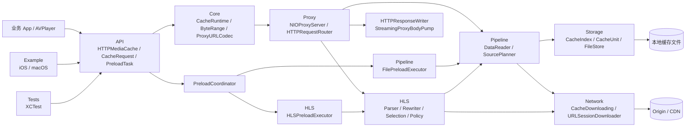
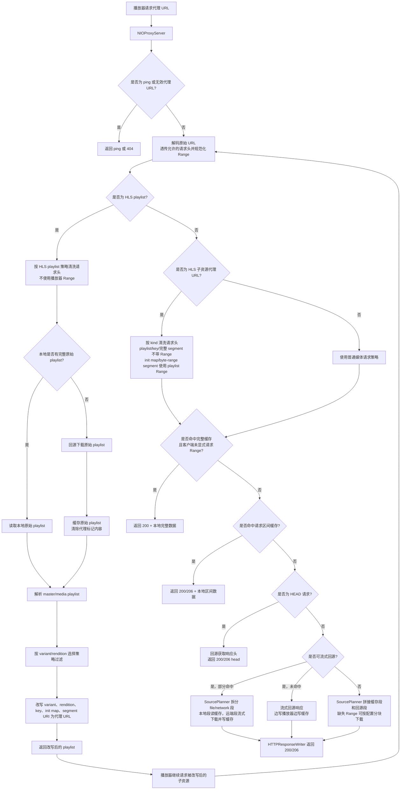
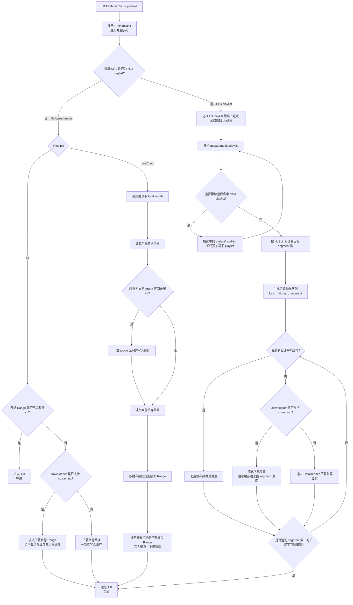

# HTTPMediaCache

[](https://github.com/sunimp/HTTPMediaCache/actions/workflows/ci.yml)
[](https://github.com/sunimp/HTTPMediaCache/releases)
[](https://swift.org)
[](Package.swift)
[](Package.swift)
[](LICENSE)

HTTPMediaCache 是一个 Swift-only 的本地 HTTP 多媒体缓存库。它通过本地代理承接播放器请求，支持普通文件与 HLS 资源的边播边缓存、Range 请求、预加载、HLS 播放列表改写、缓存查询和缓存清理。

## 特性

- 本地 HTTP 代理，播放器可直接使用代理 URL 播放。
- 支持 HTTP Range 请求，按已缓存区间和远端区间组合读取。
- 支持 MP4 等文件资源的完整或指定字节数预加载。
- 支持 HLS master/media playlist 改写，segment、key、init map 可进入缓存链路。
- 支持 HLS 预加载策略：全部、segment 数、目标时长、目标字节数。
- 支持自定义缓存 identity、HLS 分资源请求头策略和 URLSession 下载指标回调。
- 支持缓存列表、缓存进度、完整文件路径、总缓存大小和删除 API。
- 支持 iOS 与 macOS，包含示例工程和 Swift Package 测试。

## 环境要求

- iOS 15.0+
- macOS 12.0+
- Swift 5.10+
- Swift Package Manager

## 安装

在 `Package.swift` 中添加依赖：

```swift
.package(url: "https://github.com/sunimp/HTTPMediaCache.git", from: "1.0.0")
```

然后将 `HTTPMediaCache` 添加到 target dependencies：

```swift
.target(
    name: "YourApp",
    dependencies: ["HTTPMediaCache"]
)
```

## 快速开始

启动本地代理，并将原始媒体 URL 转成播放器可播放的代理 URL：

```swift
import AVFoundation
import HTTPMediaCache

try await HTTPMediaCache.start(port: 0)

let originalURL = URL(string: "https://example.com/video.mp4")!
let proxyURL = try await HTTPMediaCache.proxyURL(for: originalURL)
let player = AVPlayer(url: proxyURL)
```

需要识别或还原代理 URL 时：

```swift
if HTTPMediaCache.isProxyURL(proxyURL) {
    let restoredURL = HTTPMediaCache.originalURL(from: proxyURL)
}
```

应用退出或不再需要代理时可以停止服务：

```swift
await HTTPMediaCache.stop()
```

## 项目架构

完整架构图可查看 [Documentation/architecture.html](Documentation/architecture.html)。



## 缓存流程

HTTPMediaCache 对普通 file-based media 与 HLS 使用同一个本地代理入口，但进入代理后会按资源类型分流：



普通 file-based media 的核心是字节区间缓存：代理会先检查完整缓存或请求区间缓存；如果只命中部分区间，`SourcePlanner` 会把请求拆成 `file` 和 `network` 段，本地段直接从 `FileStore` 读取，缺失段回源下载并写回缓存，最后按客户端是否请求 Range 返回 `200` 或 `206`。

HLS 的核心是 playlist 改写：代理识别 `.m3u` 资源后，会缓存原始 playlist，并在响应播放器前把 playlist 中的 variant、rendition、segment、key、init map URI 改写成新的代理 URL。播放器随后请求这些子资源时，子资源会重新进入普通文件缓存链路；其中 playlist、key 和完整 segment 回源默认不带播放器请求头，也不会额外生成默认 Range；init map 和 byte-range segment 只使用 playlist 中声明的 `BYTERANGE` 生成 Range。

预加载也会按同样的边界分流：



## 预加载

使用统一的 `CacheRequest` 与 `PreloadOptions` 控制预加载范围：

```swift
let request = CacheRequest(url: originalURL)
let task = try await HTTPMediaCache.preload(
    request,
    options: .init(hlsLimit: .duration(30), fileLimit: .byteCount(2 * 1024 * 1024))
)

for await progress in task.progress {
    print("preload progress:", progress)
}

try await task.waitForCompletion()
```

也可以使用便捷入口：

```swift
// 预加载完整资源
let fullTask = try await HTTPMediaCache.preload(originalURL)

// 文件资源预加载指定字节数；HLS 资源按 segment 累计到指定字节数
let sizeTask = try await HTTPMediaCache.preload(originalURL, prefetchSize: 2 * 1024 * 1024)

// HLS 资源预加载指定 segment 数；文件资源会预加载完整文件
let countTask = try await HTTPMediaCache.preload(originalURL, prefetchFileCount: 3)

// HLS 资源按 EXTINF 累计到目标时长；segment 会完整缓存，不做时间点截断
let durationTask = try await HTTPMediaCache.preload(originalURL, preloadDuration: 30)
```

文件资源按字节数预加载时会先探测资源总长度，再按连续 Range 分段下载缺失的前缀区间；已有缓存区间不会重复下载。

控制预加载队列：

```swift
await HTTPMediaCache.setMaxConcurrentPreloadCount(2)
let count = await HTTPMediaCache.maxConcurrentPreloadCount()
await HTTPMediaCache.cancelAllPreloadTasks()
```

## 直接加载数据

除了本地代理播放，也可以直接创建读取器或加载器，在业务层读取数据并复用同一套缓存索引：

```swift
let request = CacheRequest(url: originalURL, range: ByteRange(start: 0, end: 1023))

let reader = await HTTPMediaCache.cacheReader(with: request)
let data = try await reader.read()

let loader = await HTTPMediaCache.cacheLoader(with: CacheRequest(url: originalURL))
let fullData = try await loader.load()

let hlsLoader = await HTTPMediaCache.cacheHLSLoader(with: CacheRequest(url: playlistURL))
let playlistData = try await hlsLoader.load()
```

## HLS 选择与改写

如果 master playlist 中有多个清晰度、音轨或字幕，可以设置选择回调。未设置时会使用默认策略。

```swift
await HTTPMediaCache.setHLSVariantStreamSelectionHandler { streams, _, _ in
    streams.max { $0.bandwidth < $1.bandwidth }
}

await HTTPMediaCache.setHLSRenditionSelectionHandler { type, renditions, _, _ in
    switch type {
    case .audio:
        return renditions.first { $0.isDefault } ?? renditions.first
    default:
        return renditions.first
    }
}
```

也可以在 HLS 内容返回给播放器前进行最后处理：

```swift
await HTTPMediaCache.setHLSContentHandler { playlist in
    playlist
}
```

如果 HLS 子资源需要独立鉴权或业务请求头，可以按资源类型提供下载请求头。Provider 返回的 `Range` 会被忽略，init map 和 byte-range segment 的 Range 仍由 playlist 中的 `BYTERANGE` 决定。

```swift
await HTTPMediaCache.setHLSDownloadHeaderProvider { context in
    switch context.kind {
    case .playlist, .variantPlaylist, .renditionPlaylist, .subtitlePlaylist, .iFramePlaylist:
        return ["Authorization": "Bearer playlist-token"]
    case .key:
        return ["Authorization": "Bearer key-token"]
    case .initialization, .segment:
        return ["Authorization": "Bearer media-token"]
    }
}
```

## 缓存查询与清理

```swift
let item = try await HTTPMediaCache.cacheItem(for: originalURL)
let allItems = try await HTTPMediaCache.allCacheItems()
let totalLength = try await HTTPMediaCache.totalCacheLength()
let completeFileURL = try await HTTPMediaCache.completeFileURL(for: originalURL)

try await HTTPMediaCache.deleteCache(for: originalURL)
try await HTTPMediaCache.deleteAllCaches()
```

限制缓存空间：

```swift
await HTTPMediaCache.setMaxCacheLength(500 * 1024 * 1024)
let maxLength = await HTTPMediaCache.maxCacheLength()
```

## 下载配置

可以配置下载超时、透传请求头、额外请求头和可接受的响应类型：

```swift
await HTTPMediaCache.setDownloadTimeoutInterval(30)
await HTTPMediaCache.setDownloadWhitelistHeaderKeys(["User-Agent", "Cookie"])
await HTTPMediaCache.setDownloadAdditionalHeaders(["X-Client": "YourApp"])
await HTTPMediaCache.setDownloadAcceptableContentTypes(["video/", "audio/", "application/vnd.apple.mpegurl"])
```

当服务端返回业务上可忽略的非媒体内容类型时，可以通过 disposer 决定是否接受该响应：

```swift
await HTTPMediaCache.setDownloadUnacceptableContentTypeDisposer { url, contentType in
    contentType == "application/octet-stream"
}
```

缺失缓存区间回源时默认会按请求区间下载；如果需要控制单次 Range 请求长度，可以配置分段策略：

```swift
await HTTPMediaCache.setDownloadRequestHeaderRangeLength { url, totalLength in
    min(totalLength, 2 * 1024 * 1024)
}
```

如果业务存在 URL 鉴权、重定向或 CDN 参数转换，可以使用 URL converter 统一处理下载侧 URL：

```swift
await HTTPMediaCache.setURLConverter { url in
    url
}
```

如果不同 URL 实际指向同一份缓存内容，可以自定义缓存 identity。设置后优先级高于 URL converter：

```swift
await HTTPMediaCache.setCacheIdentifierProvider { url in
    var components = URLComponents(url: url, resolvingAgainstBaseURL: false)
    components?.query = nil
    return components?.url?.absoluteString ?? url.absoluteString
}
```

需要观测默认 URLSession 下载性能时，可以接收每个任务的 `URLSessionTaskMetrics`：

```swift
await HTTPMediaCache.setDownloadMetricsHandler { url, metrics in
    print("download metrics:", url, metrics)
}
```

## 日志与错误

HTTPMediaCache 默认不输出控制台日志，也不记录日志文件。需要排查问题时可以按需开启：

```swift
await HTTPMediaCache.setConsoleLogEnable(true)
await HTTPMediaCache.setRecordLogEnable(true)
await HTTPMediaCache.addLog("custom business log")

let logFileURL = await HTTPMediaCache.recordLogFileURL()
await HTTPMediaCache.deleteRecordLogFile()
```

预加载或代理链路中的错误会按 URL 记录，可用于业务侧展示或诊断：

```swift
let error = await HTTPMediaCache.error(for: originalURL)
let errors = await HTTPMediaCache.errors()

await HTTPMediaCache.cleanError(for: originalURL)
await HTTPMediaCache.cleanErrors()
```

## 示例工程

仓库内提供 iOS 与 macOS 示例工程：

```bash
open Example/HTTPMediaCacheExample.xcodeproj
```

也可以直接运行测试：

```bash
swift test
```

## 参与贡献

欢迎提交 issue 和 pull request。提交前请尽量保证：

- 新增或修改行为有对应测试。
- 公开 API 保持文档注释清晰。
- Swift 代码已格式化。
- README 中的示例仍然可编译。

## 致谢

HTTPMediaCache 的实现参考了以下开源项目的设计与经验：

- [KTVHTTPCache](https://github.com/ChangbaDevs/KTVHTTPCache)
- [SJMediaCacheServer](https://github.com/changsanjiang/SJMediaCacheServer)

## License

HTTPMediaCache 基于 MIT 协议开源，详见 [LICENSE](LICENSE)。
